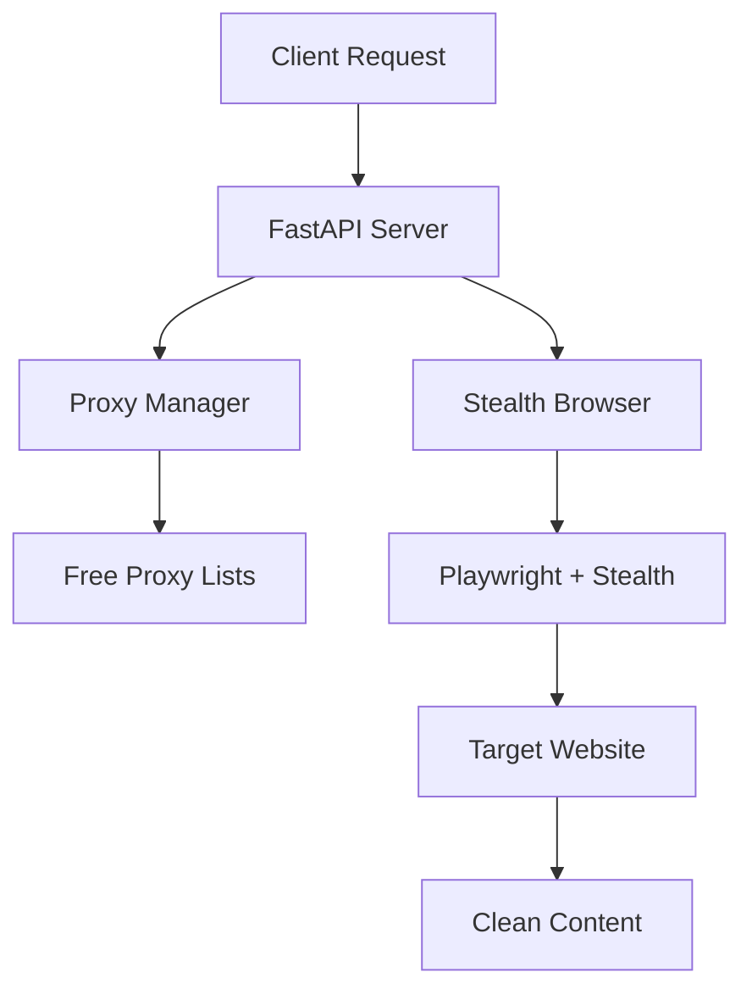

# 🧭 SureNav by ColomboAI

[](https://www.python.org/downloads/)
[](https://opensource.org/licenses/MIT)
[](https://www.docker.com/)
[](https://github.com/ColomboAI-com/surenav/actions)

**SureNav** is a fully open-source web navigation and scraping toolkit for AI agents that requires **zero API keys**. It provides anti-detection browser automation, intelligent proxy rotation, and web unblocking capabilities—completely free.

## 🧭 Part of the Cairo Operational Intelligence Ecosystem

SureNav is one protocol in the larger **Cairo Operational Intelligence ecosystem** by ColomboAI — our suite of open-source tools for autonomous AI operations.

## ✨ Features

- 🔓 **No API Keys Required** - Uses free proxy aggregation and local browser automation
- 🕵️ **Stealth Mode** - Advanced anti-detection with fingerprint randomization
- 🌍 **Global Proxy Network** - Auto-rotating free proxies from multiple sources
- ⚡ **JavaScript Rendering** - Full browser automation for modern web apps
- 🔍 **Google Search** - Scrape search results without rate limits
- 🐳 **Docker Ready** - One-command deployment
- 🔌 **API Compatible** - Similar interface to popular paid services

## 🚀 Quick Start

### Option 1: Docker (Recommended)

Build locally:
```bash
docker build -t surenav .
docker run -p 8000:8000 surenav
```

Or pull from GitHub Container Registry (coming soon):
```bash
docker run -p 8000:8000 ghcr.io/colomboai-com/surenav:latest
```

### Option 2: Local Installation

From source:
```bash
git clone https://github.com/ColomboAI-com/surenav.git
cd surenav
pip install -r requirements.txt
playwright install chromium
python -m src.server
```

PyPI package (coming soon):
```bash
pip install surenav
playwright install chromium
surenav-server
```

## 📖 Usage

### Fetch a Web Page

```bash
curl "http://localhost:8000/browser?url=https://example.com"
```

### Search Google

```bash
# JSON output
curl "http://localhost:8000/search?terms=open+source+ai&format=json"

# HTML output
curl "http://localhost:8000/search?terms=python+tutorial"
```

### Python SDK

```python
import asyncio
from surenav import StealthBrowser

async def main():
    browser = StealthBrowser()
    await browser.start()
    result = await browser.fetch_page("https://example.com")
    print(result["content"])
    await browser.stop()

if __name__ == "__main__":
    asyncio.run(main())
```

## 🏗️ Architecture



## ⚙️ Configuration

Environment variables:

| Variable | Default | Description |
|----------|---------|-------------|
| `SURENAV_PORT` | 8000 | Server port |
| `SURENAV_PROXY_REFRESH` | 300 | Proxy refresh interval (seconds) |
| `SURENAV_HEADLESS` | true | Run browser headless |
| `SURENAV_MAX_RETRIES` | 3 | Retry attempts per request |

## 🛡️ Anti-Detection Features

- ✅ User agent rotation
- ✅ Viewport fingerprint randomization
- ✅ WebGL/Canvas noise injection
- ✅ Automation flag removal
- ✅ Mouse movement humanization
- ✅ Cookie/session handling
- 🚧 TLS/JA3 fingerprint randomization (planned - see roadmap)

## ⚠️ Legal Notice

**Important:** SureNav is designed for legitimate web automation. Users must comply with website Terms of Service and applicable laws. See [LEGAL_NOTICE.md](LEGAL_NOTICE.md) for full details.

- ✅ Use for public data, research, your own sites
- ❌ Don't bypass auth, scrape private data, or violate ToS
- 🤝 Respect robots.txt and rate limits

## 🤝 Contributing

Contributions welcome! See [CONTRIBUTING.md](CONTRIBUTING.md).

## 🗺️ Roadmap

- [ ] PyPI package publication
- [ ] GitHub Container Registry auto-publish
- [ ] TLS/JA3 fingerprint randomization
- [ ] SOCKS5 proxy support
- [ ] Built-in CAPTCHA solving integration
- [ ] Distributed proxy mesh
- [ ] Web UI dashboard

## 📜 License

MIT - Free for personal and commercial use. See [LICENSE](LICENSE).

---

**Built with ❤️ by ColomboAI** | Part of the Cairo Operational Intelligence ecosystem
